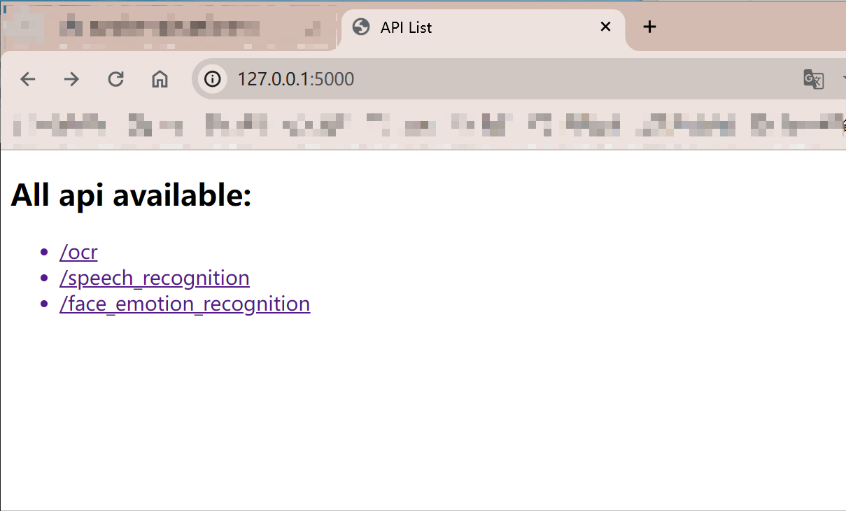
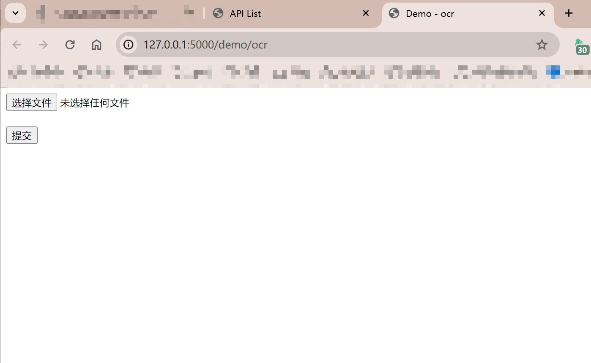

## Hololens2_Server

本项目是为科研项目开发的服务器端程序，基于[Flask](https://flask.palletsprojects.com/en/3.0.x/)轻量级Web应用框架

- ocr文字识别功能实现参考项目：[chineseocr_lite](https://github.com/DayBreak-u/chineseocr_lite)

- 面部表情识别功能参考项目：[Emotion-recognition](https://github.com/otaha178/Emotion-recognition)

- 语音识别功能参考项目：[whisper](https://github.com/openai/whisper)

> 相关功能详情可以查看对应项目仓库，本项目仅对现有开源项目进行了封装，功能部分未做过多改进

## 项目启动方法

1. 安装Anaconda，并安装项目依赖

   > 推荐使用命令：`pip install -r requirements.txt`
   >
   > 本项目推荐使用：`Python==3.9`

2. 修改 `app` 文件夹中的 `run.bat` | `run.sh` 文件中的Anaconda虚拟环境名

   > 我使用的环境名为 `hololens2` ，推荐使用命令：
   >
   >  `conda create -n hololens2 python==3.9`

3. 等待命令行终端启动完成，打开浏览器，输入网址：`http://localhost:5000`

4. 点击对应的文本超链接可以测试已经写好的Web测试应用

